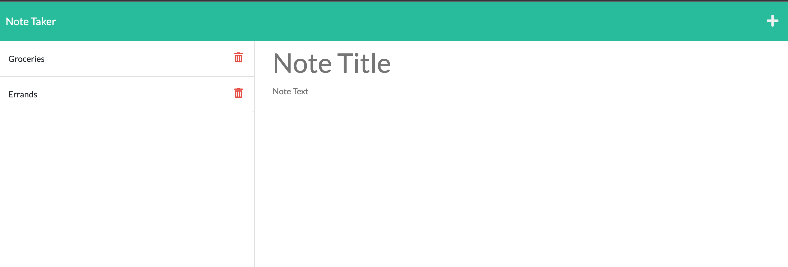

# Note Taker Starter Code

## Description

This application allows a user to write a save notes.

- This application makes it easy to write down notes and save them for future reference.
- I built this project to create a way to save notes to a database and retrieve them.
- I learnt how to use express.js during this project.

## Installation

- Start server.js by running node server.js in IDE
- Navigate to localhost:3001 to view homepage
- Click "Get Started"

## Usage

Provide instructions and examples for use. Include screenshots as needed.
- Click "Get Started"

- Click and fill in note title.

- Click and fill in note text.
- Click save to add new note to left side bar.

